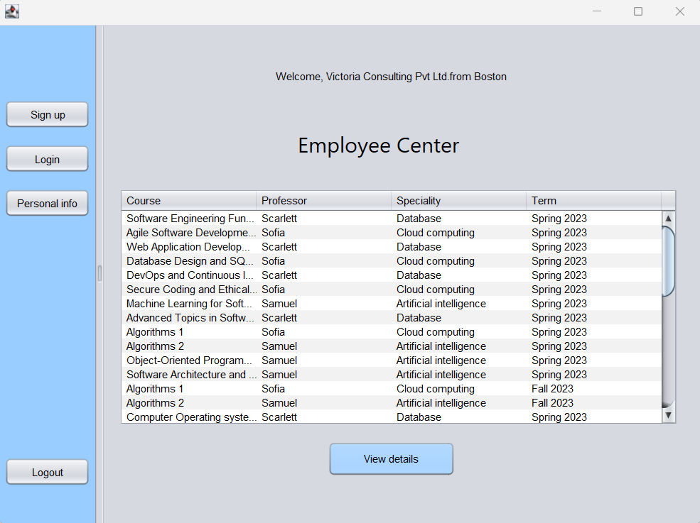

# Digital Education System

# Summary
This report outlines the design and implementation of an alternative digital educational platform aimed at decentralizing education and empowering professors to create and manage courses. The objective of this project is to leverage software engineering techniques to increase access to education and improve the quality of education worldwide. 

# Introduction
The project involves the design and implementation of an alternative educational platform, where professors are central to students' learning. In this platform, professors own and benefit from their teaching talent and experience, rather than educational institutions. Key objectives include:

- Professor autonomy in course management and delivery.
- Students ability to browse and register for courses.
- A certificate authority is created to decide of the graduation eligibility of students
- Administrator to view performance dashboard and user management in the application
- As part of additional requirement, Employee Engagement has been implemented to rate professors.

# Application Architecture
The system is designed to be decentralized and distributed. Professors join the platform from anywhere in the world and offer their courses remotely. The architecture consists of the following components:
- Professor Dashboard: Professors can create, manage, and schedule courses. They have full autonomy to determine course content and structure.
- Student Registration: Students can sign up for courses of their choice at their convenience.
- Certificate Authority: Students must fulfill course requirements by taking classes from various professors located globally.
- Employee Engagement: Employer can rate professors.
- Admin Dashboard: Admin role is made to do user configuration and see performance dashboard.

# Features and Functionality (Use cases covered)

1. System Startup and Configuration: The system seems to have a robust initial configuration, with features like a universal student directory and certification authority for graduation requirements. This ensures that students can easily navigate the platform and track their academic progress.

2. Professor Management: Professors can efficiently manage their course catalog and schedules, allowing them to provide a seamless educational experience for students.

3. Student Registration and Transcript: Students can sign up, register for courses, and generate transcripts, streamlining the administrative process for learners.

4. Course Scheduling: Professors can create and manage their course schedules, making it easier for students to plan their academic journey.

5. Course Search: Students can search for courses based on various criteria, providing flexibility in their course selection.

6. Student Course Registration: The ability for students to register for courses and view professor ratings adds an element of choice and transparency to the platform.

7. Graduation Requirements: The system reviews student transcripts to determine if they meet the graduation requirements, simplifying the graduation process.

8. Admin Dashboard Performance panel: The dashboard for platform owners to collect performance data is a valuable feature for tracking and improving the system's overall performance.

## Additional User cases

9. Employee Engagement Module: This innovative addition allows employers to engage with professors and rate their courses, potentially facilitating partnerships between educational institutions and employers.

10. Professor Rating by Employers: Employers' ability to rate professors provides a valuable feedback mechanism for instructors and enhances the platform's overall quality.

11. User Management by Admin: The user management section is crucial for maintaining the platform's integrity and security.

12. Student Ranking: The ability to rank students provides a way for professors to identify high-performing students, potentially enhancing their academic experience.

13. Personal Information: The option for users to update their personal information adds a layer of customization and user-friendliness.

14. Logout Button: A simple but essential feature that ensures user security and privacy.

# Technology Stack
The platform is built using a modern technology stack, including:
- IDE : Netbeans
- Backend: Java

#  Implementation
The platform was implemented using an iterative approach, with continuous integration and deployment. The professor and student interfaces were developed to provide a user-friendly experience. The app is implemented in Netbeans with following classes  given from  base code:

# Conclusion
In conclusion, the outlined solution covers a wide range of functionalities and use cases, making it a comprehensive platform for students, professors, and administrators. The additional innovative features, such as the employee engagement module and student ranking, enhance the platform's utility and provide a well-rounded experience for all users. This system has the potential to streamline academic processes, promote engagement, and facilitate collaboration between educational institutions and employers.
